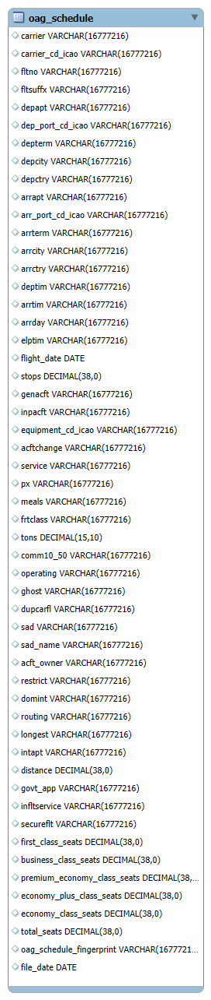
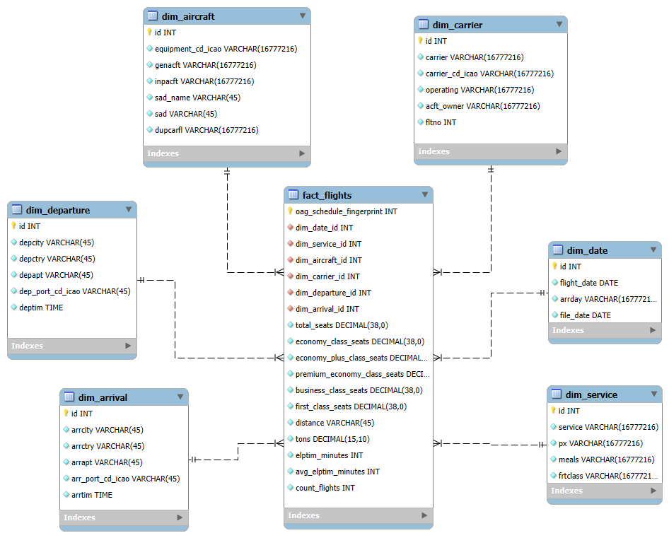
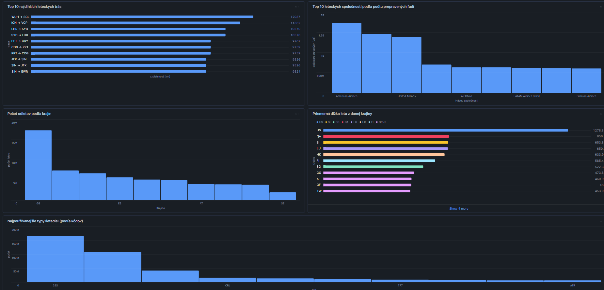
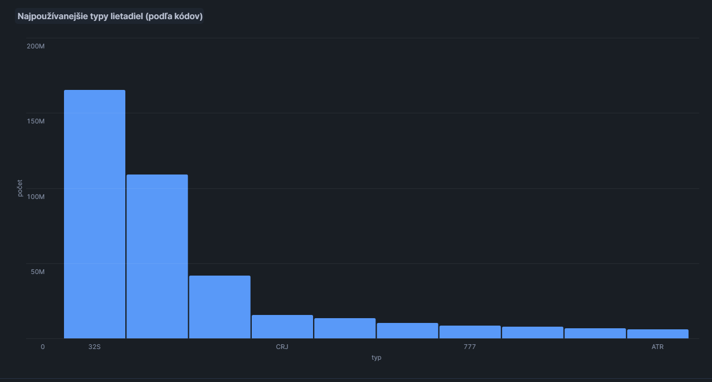

# Projekt - OAG_GLOBAL_AIRLINE_SCHEDULES


 ## **1. Úvod a popis zdrojových dát** 

Vybrali sme si dataset od spoločnosti OAG (dostupný cez Snowflake Marketplace), pretože poskytuje komplexný pohľad na logistiku leteckej dopravy vrátane detailných informácií o konfigurácii sedadiel a trasách.

Dáta podporujú proces Plánovania leteckých kapacít a optimalizácie sietí (Network Planning). Tento proces umožňuje aerolinkám a letiskám analyzovať ponuku miest na trhu a efektivitu využitia lietadiel.

**Dataset obsahuje štruktúrované údaje, ktoré môžeme rozdeliť do niekoľkých kategórií:**

**Identifikačné údaje letov:** Čísla letov, ICAO kódy dopravcov a unikátne identifikátory (fingerprints).

**Časové údaje:** Dátumy letov, časy odletov a príletov, celkový uplynutý čas (Elapsed Time).

**Kapacitné údaje:** Celkový počet sedadiel rozdelený podľa cestovných tried (Economy, Business, First Class, Premium Economy).

**Geografické údaje:** Mestá a krajiny odletu/príletu, ICAO kódy letísk a celková vzdialenosť (Distance).


Cieľom analýzy je transformovať surové dáta do formy hviezdicovej schémy (Star Schema). Analýza sa zameriava na:
Porovnanie celkového počtu prepravených ľudí u hlavných aerolínií.
Sledovanie priemerných dĺžok letov a geografického rozloženia dopravy.
Identifikácia vyťaženosti leteckej siete v rámci jednotlivých dní v týždni.
Analýza najvýznamnejších svetových letísk z hľadiska hustoty prevádzky.

V povodnej tabulke sa nachadzaju udaje o priletoch a odletoch,
údaje o konrétnych typoch lietadla ako aj názov leteckej spoločnosti.
Taktiež sa tu nachádzajú údaje o rôznych triedach pre cestujúcich (economy,first class,businnes class) a dátumoch letov.


<p align="center">
  
  <br>
  <em>Obrázok 1 ERD diagram</em>
</p>

---

## **2. Návrh dimenzionálneho modelu**

Model je navrhnutý ako klasická hviezdicová schéma, kde centrálna tabuľka faktov je prepojená s viacerými dimenziami pomocou vzťahu 1:N.

**Tabuľka faktov:** fact_flights

Tabuľka faktov uchováva kvantitatívne údaje o jednotlivých letoch a slúži ako centrálny bod analýzy.

**Primárny kľúč:** oag_schedule_fingerprint (unikátny identifikátor letového poriadku).

**Cudzie kľúče:**  
dim_date_id (prepojenie na časovú os).  
dim_carrier_id (prepojenie na leteckého dopravcu).  
dim_aircraft_id (prepojenie na typ lietadla).  
dim_departure_id a dim_arrival_id (prepojenie na geografické údaje).  
dim_service_id (prepojenie na údaje služieb).


**Tabuľky dimenzíí:**
Pre každú dimenziu sme zvolili SCD Typ 0 (Original), pretože letecké poriadky v tomto datasete sú historické záznamy, kde sa atribúty spätne nemenia. V prípade potreby sledovania zmien (napr. zmena názvu aerolinky v čase) by sa využil SCD Typ 2.

**`dim_date`** - časové atribúty(dátum letu, deň v týždni, časový posun)

**`dim_carrier`** - Informácie o dopravcovi (názov, ICAO kód, vlastník lietadla, číslo letu).

**`dim_aircraft`** - Technické parametre lietadla (typ, výrobca, názov modelu meno spoločnosti).

**`dim_departure`** - Detail letiska odletu (mesto, krajina, kód portu, čas odletu).

**`dim_arrival`** - Detail letiska príletu (mesto, krajina, kód portu, čas príletu).

**`dim_service`** - Informácie o type servisu (palubné jedlo, trieda nákladu)


<p align="center">
  
  <br>
  <em>Obrázok 2 Dimenzionálny model</em>
</p>

---

## **3. ELT proces v Snowflake**
# **Extract**


Dáta boli získané zo Snowflake Marketplace. Bol vybraný dataset globálnych leteckých poriadkov od spoločnosti OAG.

Zdrojová databáza: **`OAG_GLOBAL_AIRLINE_SCHEDULES_SAMPLE`**

Zdrojová schéma: **`PUBLIC`**

Zdrojová tabuľka: **`OAG_SCHEDULE`**

Prvým krokom bolo vytvorenie staging tabuľky, ktorá slúži ako dočasné úložisko pre surové dáta pred ich ďalším spracovaním.
```sql
CREATE TABLE airline_schedules_staging AS SELECT *
FROM oag_global_airline_schedules_sample.public.oag_schedule;
```
 Tento príkaz skopíruje všetky záznamy zo zdieľaného datasetu do našej lokálnej tabuľky flights, čím umožní vykonávať transformácie bez ovplyvnenia zdrojových dát.


# **Transform**


V tejto fáze dochádza k čisteniu dát, deduplikácii a tvorbe dimenzií. Využili sme techniku SCD Typ 0, kde sú historické údaje zachované v pôvodnom stave.

Tvorba dimenzií a čistenie
Pri tvorbe dimenzií sme použili klauzulu DISTINCT na odstránenie duplicít a funkciu ROW_NUMBER() na generovanie unikátnych kľúčov.

**Príklad transformácie (Dimenzia dopravcov):**
```sql
CREATE or replace TABLE dim_carrier AS
SELECT ROW_NUMBER() OVER (ORDER BY carrier,carrier_cd_icao,operating,acft_owner,fltno) AS id,   -- vytváranie id
  carrier,
  carrier_cd_icao,
  operating,
  acft_owner,
  CAST(fltno AS INT) AS fltno   -- konvertovanie string na int
FROM (SELECT DISTINCT carrier, carrier_cd_icao, operating, acft_owner, fltno
  FROM airline_schedules_staging);
```

 ROW_NUMBER() zabezpečí pridelenie unikátneho sekvenčného ID každému unikátnemu dopravcovi. DISTINCT zabezpečí, že každá kombinácia atribútov sa v dimenzii nachádza iba raz.

**Dimenzia časov:**
```sql
 CREATE or replace TABLE dim_date AS
SELECT ROW_NUMBER() OVER (ORDER BY flight_date, arrday, file_date) AS id,     -- vytváranie id
  flight_date,
  arrday,
  file_date
FROM (SELECT DISTINCT flight_date, arrday, file_date
  FROM airline_schedules_staging);
```

**Dimenzia lietadiel:**
```sql
CREATE or replace TABLE dim_arrival AS
SELECT ROW_NUMBER() OVER (ORDER BY arrcity, arrctry, arrapt, arr_port_cd_icao, arrtim) AS id,  -- vytváranie id
  arrcity,
  arrctry,
  arrapt,
  arr_port_cd_icao,
  TO_TIME( CONCAT( SUBSTR( arrtim, 1, 2), ':', SUBSTR( arrtim, 3, 2))) AS arrtim      -- konvertovanie string na time
FROM( SELECT DISTINCT arrcity, arrctry, arrapt, arr_port_cd_icao, arrtim
  FROM airline_schedules_staging);
```

**Dimenzia služieb:**
```sql
CREATE or replace TABLE dim_service AS
SELECT ROW_NUMBER() OVER (ORDER BY service, px, meals, frtclass) AS id,        -- vytváranie id
  service,
  px,
  meals,
  frtclass
FROM (SELECT DISTINCT service, px, meals, frtclass
  FROM airline_schedules_staging);
```

**Dimenzia odletov:**
```sql
CREATE or replace TABLE dim_departure AS
SELECT ROW_NUMBER() OVER (ORDER BY depcity, depctry, depapt, dep_port_cd_icao, deptim) AS id,   -- vytváranie id
  depcity,
  depctry,
  depapt,
  dep_port_cd_icao,
  TO_TIME(CONCAT( SUBSTR( deptim, 1, 2), ':', SUBSTR( deptim, 3, 2))) AS deptim  -- konvertovanie string na time
FROM(SELECT DISTINCT depcity, depctry, depapt, dep_port_cd_icao, deptim
  FROM airline_schedules_staging);
```

**Dimenzia príletov:**
```sql
CREATE or replace TABLE dim_arrival AS
SELECT ROW_NUMBER() OVER (ORDER BY arrcity, arrctry, arrapt, arr_port_cd_icao, arrtim) AS id,   -- vytváranie id
  arrcity,
  arrctry,
  arrapt,
  arr_port_cd_icao,
  TO_TIME( CONCAT( SUBSTR( arrtim, 1, 2), ':', SUBSTR( arrtim, 3, 2))) AS arrtim      -- konvertovanie string na time
FROM( SELECT DISTINCT arrcity, arrctry, arrapt, arr_port_cd_icao, arrtim
  FROM airline_schedules_staging);
```


# **Load**


V záverečnej fáze ELT procesu sme naplnili faktovú tabuľku fact_flights. Tento krok transformuje ploché dáta zo stagingu do relačnej štruktúry.

**Hlavný sql príkaz:**
```sql
CREATE or replace TABLE fact_flights AS 
(SELECT fli.OAG_SCHEDULE_FINGERPRINT AS fingerprint,
  dep.id AS departure_id,
  arr.id AS arrival_id,
  air.id AS aircraft_id,
  car.id AS carrier_id,
  dat.id AS date_id,
  ser.id AS service_id,
  fli.total_seats,
  fli.economy_class_seats,
  fli.economy_plus_class_seats,
  fli.premium_economy_class_seats,
  fli.business_class_seats,
  fli.first_class_seats,
  fli.distance,
  fli.tons,
  ((CAST( SUBSTR( fli.elptim, 1, 3) AS INT) * 60) + (CAST( SUBSTR( fli.elptim, 4, 2) AS INT)))
    AS elptim_minutes, -- konvertovanie HHHMM na číslo reprezentujúce čas letu v minútach
  AVG(( CAST( SUBSTR( fli.elptim,1,3) AS INT) * 60) + (CAST( SUBSTR( fli.elptim, 4, 2) AS INT)))
    OVER (PARTITION BY fli.depcity,fli.depctry,fli.arrcity,fli.arrctry)
    AS avg_elptim_minutes,  -- vypocet priemerneho času letu z destinácie A do B
  COUNT(fli.oag_schedule_fingerprint) OVER (PARTITION BY fli.depcity, fli.depctry, fli.arrcity, fli.arrctry)
    AS count_flights        // počet uskutočnených letov z destinácie A do B
FROM airline_schedules_staging fli
  JOIN dim_departure dep ON fli.depcity = dep.depcity AND fli.depctry = dep.depctry AND fli.depapt = dep.depapt AND
    fli.dep_port_cd_icao = dep.dep_port_cd_icao AND TO_TIME( CONCAT( SUBSTR( fli.deptim, 1, 2), ':', SUBSTR( fli.deptim, 3, 2))) = dep.deptim
  JOIN dim_arrival arr ON fli.arrcity=arr.arrcity AND fli.arrctry=arr.arrctry AND fli.arrapt=arr.arrapt AND
    fli.arr_port_cd_icao=arr.arr_port_cd_icao AND CONCAT(SUBSTR(fli.arrtim,1,2),':',SUBSTR(fli.arrtim,3,2))=arr.arrtim
  JOIN dim_aircraft air ON fli.equipment_cd_icao=air.equipment_cd_icao AND fli.genacft=air.genacft AND fli.inpacft=air.inpacft AND
    fli.sad_name=air.sad_name AND fli.sad=air.sad AND fli.dupcarfl=air.dupcarfl
  JOIN dim_carrier car ON fli.carrier=car.carrier AND fli.carrier_cd_icao=car.carrier_cd_icao AND fli.operating=car.operating AND
    fli.acft_owner=car.acft_owner AND CAST(fli.fltno AS INT)=car.fltno
  JOIN dim_date dat ON fli.flight_date=dat.flight_date AND fli.arrday=dat.arrday AND fli.file_date=dat.file_date
  JOIN dim_service ser ON fli.service=ser.service AND fli.px=ser.px AND fli.meals=ser.meals AND fli.frtclass=ser.frtclass);
```
---

## **4. Vizualizácia dát**

Dashboard obsahuje 5 kľúčových vizualizácií, ktoré poskytujú prehľad o kapacitách, operačnej efektivite a geografickom rozložení letov. Tieto vizualizácie umožňujú manažmentu leteckých spoločností a letísk lepšie pochopiť dynamiku trhu.

<p align="center">
  
  <br>
  <em>Obrázok 3 Dashboard grafov</em>
</p>


**Graf 1: Top 10 najdlhších leteckých trás (vzdialenosť):**

<p align="center">
  
  <br>
  <em>Obrázok 4 graf 1</em>
</p>

Táto vizualizácia identifikuje najdlhšie trasy (long-haul), najdlhšia bola z Wuhanu(Čína) do Santiago (Ćile)

```sql
SELECT 
    CONCAT(dep.depapt, ' -> ', arr.arrapt) AS route,
    MAX( f.distance) AS route_distance
FROM fact_flights f
JOIN dim_departure dep ON f.departure_id = dep.id
JOIN dim_arrival arr ON f.arrival_id = arr.id
GROUP BY route
ORDER BY route_distance DESC
LIMIT 10;

```


**Graf 2: Top 10 leteckých spoločností podľa počtu prepravených ľudí:**

<p align="center">
  
  <br>
  <em>Obrázok 5 graf 2</em>
</p>

Táto vizualizácia odpovedá na otázku, ktoré letecké spoločnosti dominujú trhu z hľadiska objemu prepravnej kapacity. Najviac ľudí prepravilo Delta Airlines.Druhý za ním je American Airlines.

```sql
SELECT 
    a.sad_name AS airline_name, 
    SUM( COALESCE( f.total_seats, 0)) AS total_capacity
FROM fact_flights f
JOIN dim_aircraft a ON f.aircraft_id = a.id
GROUP BY airline_name
HAVING total_capacity > 0
ORDER BY total_capacity DESC
LIMIT 10;
```

**Graf 3:Počet odletov podľa krajín:**

<p align="center">
  
  <br>
  <em>Obrázok 6 graf 3</em>
</p>

Táto vizualizácia poskytuje prehľad o tom, ktoré krajiny generujú najväčší objem leteckej dopravy. Identifikuje kľúčové trhy a geografické centrá, z ktorých lietadlá najčastejšie štartujú. Najviac odletelo z Veľkej Británie

```sql
SELECT 
    dep.depctry AS departure_country,
    COUNT(*) AS number_of_flights
FROM fact_flights f
JOIN dim_departure dep ON f.dim_departure_id = dep.id
GROUP BY departure_country
ORDER BY number_of_flights DESC
LIMIT 10;
```

**Graf 4:Priemerná dlžka letu z danej krajiny:**

<p align="center">
  
  <br>
  <em>Obrázok 7 graf 4</em>
</p>

Táto vizualizácia analyzuje priemernú dĺžku letu. Pomáha identifikovať krajiny, ktoré sú primárne orientované na diaľkovú prepravu (long-haul) v porovnaní s krajinami s prevahou regionálnych letov. V tejto analýze vidieť prevahu najdlhšiích letov z Ameriky

```sql
SELECT 
    depctry AS country, 
    ROUND(AVG(NULLIF(elptim, 0)), 2) AS avg_duration
FROM flights
WHERE depctry IS NOT NULL 
  AND elptim > 0
GROUP BY country
ORDER BY avg_duration DESC
LIMIT 15;
```

**Graf 5:Najpoužívanejšie typy lietadiel (podľa kódov):**

<p align="center">
  
  <br>
  <em>Obrázok 8 graf 5</em>
</p>

Tento graf zobrazuje distribúciu letov podľa kódov typov lietadiel. Na osi X vidíme technické označenia (napr. 32S pre Airbus A320).Dominancia kódu 32S a 737 potvrdzuje, že väčšina globálnej leteckej dopravy je realizovaná lietadlami na krátke a stredné vzdialenosti. 

```sql
SELECT a.genacft AS aircraft_type,
  COUNT(*) AS total_flights
FROM fact_flights f
  JOIN dim_aircraft a ON f.aircraft_id = a.id GROUP BY aircraft_type
  ORDER BY total_flights DESC
LIMIT 10;
```
---

**Autor:** Daniel Kuchar   ,   Juraj Švajda
